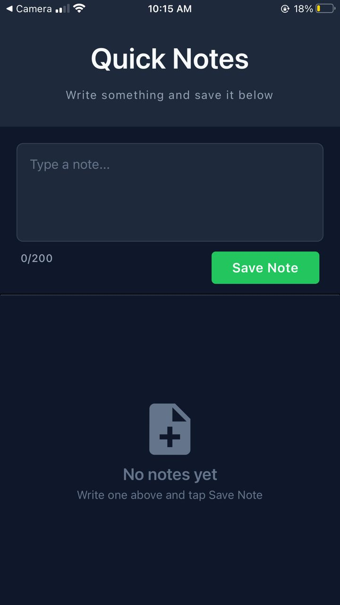

# notes-mobile-app

A simple and elegant note-taking application built with React Native and Expo. Quickly jot down your thoughts and ideas with an intuitive dark-themed interface.

## UI Screenshot



## Features

- **Quick Note Creation**: Write notes with a user-friendly text input interface
- **Character Limit**: 200-character limit per note with real-time character counter
- **Note Management**: View all saved notes in a scrollable list
- **Delete Notes**: Remove notes you no longer need with a single tap
- **Timestamps**: Automatic timestamps for each note showing when it was created
- **Dark Theme**: Modern dark-themed UI with a pleasant color palette
- **Cross-Platform**: Works on iOS and Android via Expo

## Installation

### Prerequisites

- Node.js
- npm or yarn
- Expo CLI (`npm install -g expo-cli`)

### Setup

1. Clone the repository:

   ```bash
   git clone https://github.com/Xebec186/notes-mobile-app
   cd notes-mobile-app
   ```

2. Install dependencies:

   ```bash
   npm install
   ```

3. Start the development server:
   ```bash
   npx expo start
   ```
4. Scan the QR code using the Expo Go app on your device or run it on an emulator.

## Usage

1. **Create a Note**: Type your note in the text input field at the top of the screen
2. **Character Counter**: The counter shows how many characters you've typed (max 200)
3. **Save Note**: Tap the green "Save Note" button to save your note
4. **View Notes**: Saved notes appear in the list below with their creation timestamp
5. **Delete Note**: Tap the trash icon on any note to delete it

## Technologies Used

- **React Native** - Cross-platform mobile framework
- **Expo** - React Native development platform
- **React Hooks** - State management (useState)
- **Material Icons** - Icon library via `@expo/vector-icons`

## App Styling

The app uses a dark theme with the following color scheme:

- **Background**: `#0F172A` (Deep Navy)
- **Surface**: `#1E293B` (Dark Slate)
- **Text**: `#F8FAFC` (Off-White)
- **Secondary Text**: `#94A3B8` (Slate Gray)
- **Accent**: `#22C55E` (Green)

## Future Improvements

- **Data Persistence**: implement local storage using AsyncStorage or SQLite to persist notes across app sessions
- **Cloud Sync**: Add cloud backup and sync functionality using Firebase or similar backend
- **Note Editing**: Allow users to edit existing notes instead of only deleting them
- **Search & Filter**: Add search functionality to find notes by content or date range
- **Categories/Tags**: Organize notes with custom categories or tags
- **Rich Text Support**: Enable formatting options (bold, italic, bullet points, etc.)
- **Pin/Favorite Notes**: Mark important notes as favorites or pin them to the top
- **Dark/Light Theme Toggle**: Add user preference for light theme
- **Note Sharing**: Share notes via email, messaging, or social media
- **Voice Notes**: Record and transcribe audio notes
- **Reminders/Notifications**: Set reminders for specific notes
- **Backup & Export**: Export notes as PDF or text files
